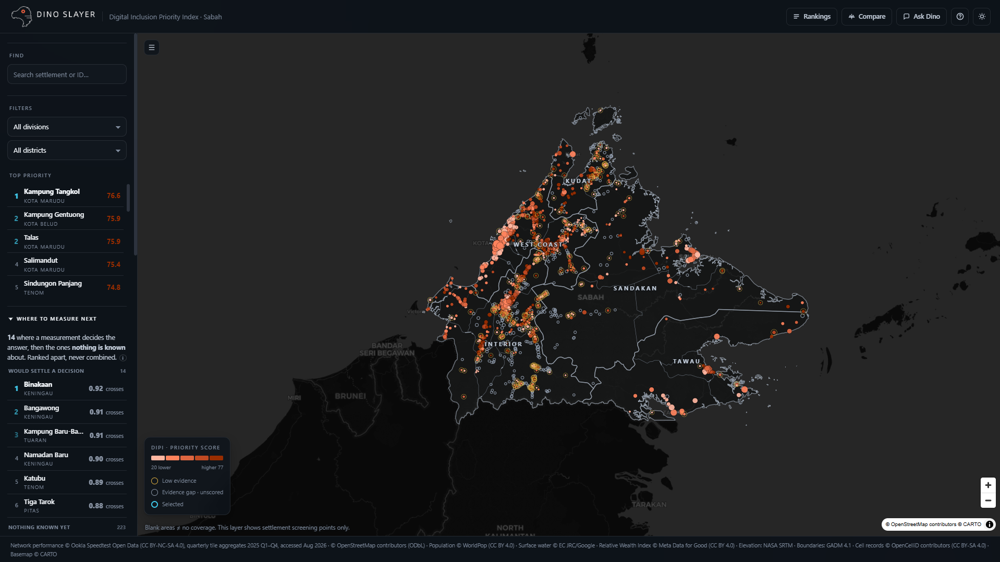
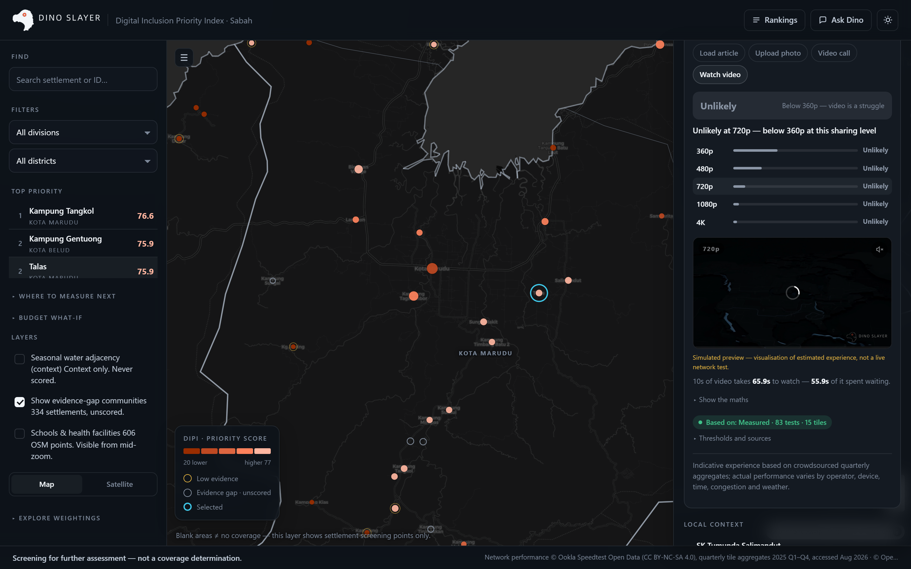
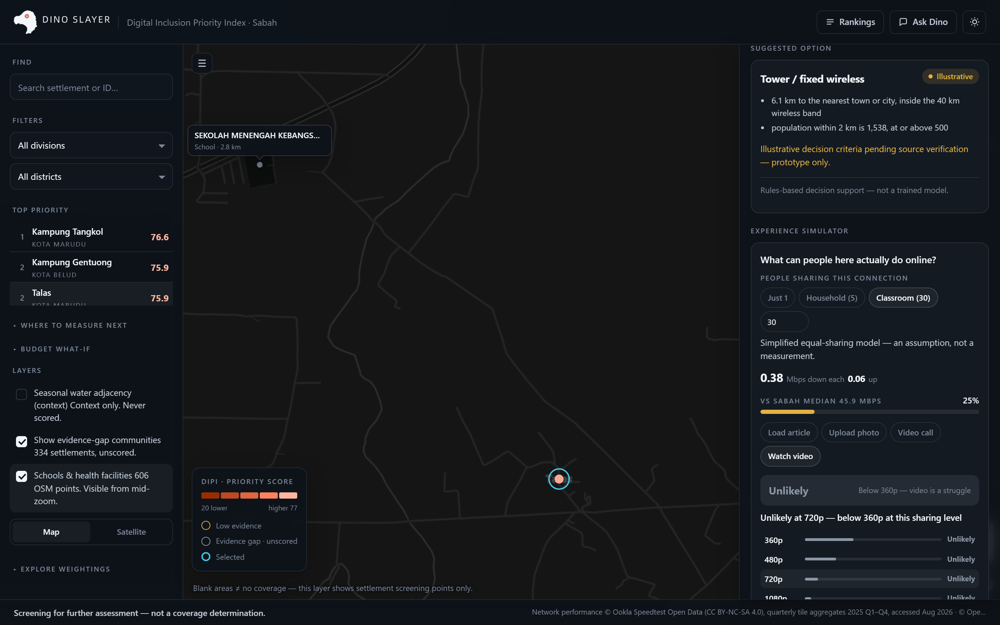
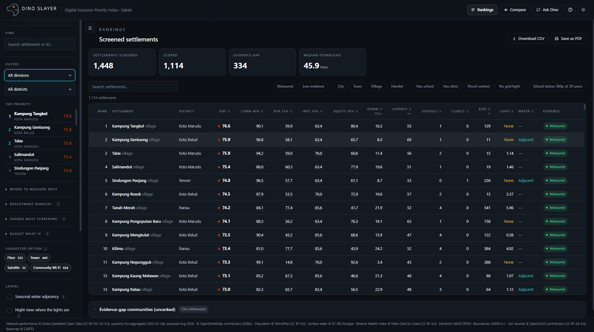
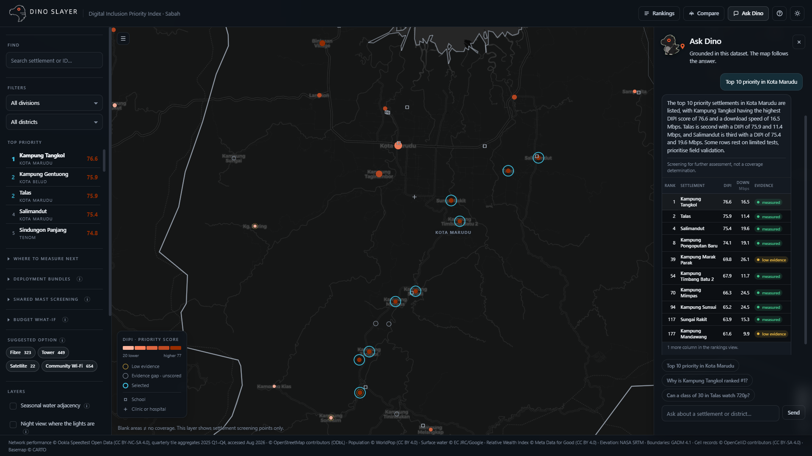
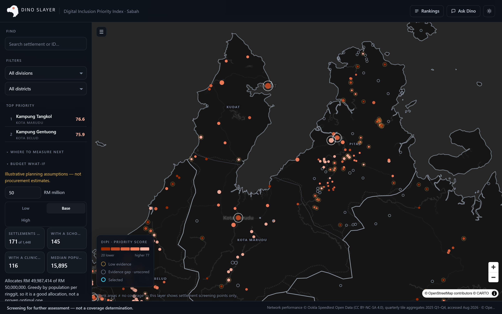
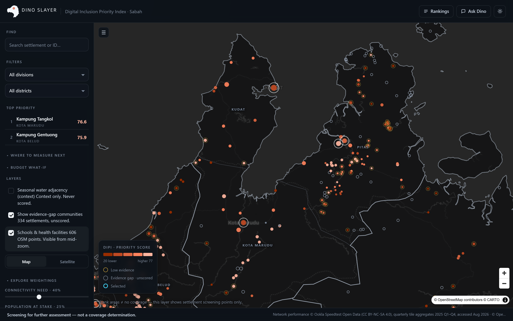
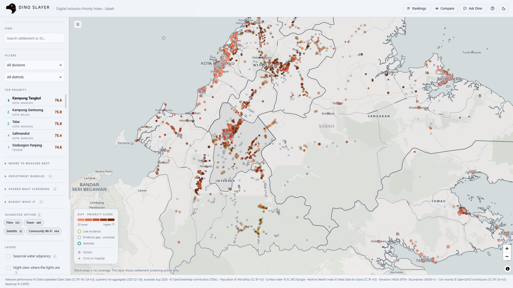

<div align="center">


### 1,448 villages in Sabah. One ranked list of where to look first.

A planning tool that scores every mapped settlement in Sabah on how badly it needs a
connectivity intervention, shows you the evidence behind each score, and lets you argue
with the weighting live. Ask it a question in plain English and the map follows the answer.

Built for **ASEAN GeoAI Fusion 2026** · Open data only · No account, no build step

</div>

---

## Why we built it

Everyone already knows rural Sabah has a connectivity problem. What nobody could hand a
planner was a defensible answer to the next question, which village do we drive to first.

The honest obstacle is that we do not have coverage data. We have crowdsourced speed
tests, which is a different thing. A village with no Ookla samples is not a village with
no coverage, it is a village nobody has tested. Treating those two as the same is the
mistake that makes a map like this dangerous, so the whole tool is built around refusing
to make it.

So Dino Slayer scores what it can measure, says out loud where the measurement runs out,
and puts the 334 settlements it cannot score into a separate queue with their own ranking
for who to go and measure next. It screens. It does not certify.

---

## A walk through the dashboard

**The map.** Every settlement, coloured by priority. The deeper the red, the sooner it
needs attention. Hollow rings are the settlements with too little measurement to score, so
an evidence gap looks like an evidence gap and never like good news.



**Click any settlement.** The full case for its score, pillar by pillar, with the raw
numbers that produced each one and how much measurement is behind them.

**"What can people here actually do online?"** The Experience Simulator turns a speed into
a sentence a minister can use. Set how many people share the connection, pick a task, and
watch a real clip play at the quality that link can carry. At 30 users, Talas gets 0.38
Mbps each and everything stalls.



**Nearby schools and clinics.** The same 3 km buffer that feeds the Institutions pillar,
drawn on the map so you can see what a fix would actually reach.



**The ground it all sits on.** Telecom GeoAI is usually framed as three layers: network
performance, physical landscape, and human demand. Ookla is the first and WorldPop plus RWI
are the third. Elevation is the second, and it turns out to matter: across the scored
settlements it correlates -0.25 with measured download speed, a stronger relationship than
distance to the nearest town. Every drill-down carries a terrain reading, and a hillshade
layer draws the hills a link would have to cross.

Terrain never enters the score. It explains a slow link and it qualifies a siting
recommendation. 165 settlements sit at least 150 m below the town their nearest mast would
be in, and 132 of those are in Ranau, under Kinabalu.

**The rankings.** All 1,114 scored settlements, sortable by any column, filterable by
district, evidence tier, place type, and whether a classroom of 30 could stream 360p.
Sorting never renumbers the rank column, so row 1 sorted by latency is never mistaken for
the top priority. What you see is what the CSV exports.



**Ask Dino.** Type a question, get an answer grounded in this dataset, and watch the map
fly to what the answer is about. Every number in the reply comes from a Python tool, never
from the model.



**The coverage model.** 216 settlements have no usable measurement at all. A gradient
model trained on the 850 measured ones estimates a speed for each, with a prediction
interval and its top three SHAP drivers. It is validated with GroupKFold by district
because 29% of settlements share an Ookla tile with a neighbour, and the honest number is
the spatial one: MAE 34.1 Mbps against 25.3 under a naive random split. That 35% gap is
the finding. No modelled number appears anywhere without a one-click model card carrying
those figures, and a modelled speed is never merged into the official ranking.

**Where to measure next.** The 334 unscored settlements ranked by what is at stake if they
turn out to be badly served, times how wide the model's prediction interval is, so the
survey goes where a lot is riding on an answer nobody has. Both factors are shown, never
their product: stakes times Mbps has no unit.


**Budget what-if.** Set a budget, see how far down the priority list it reaches, and read
the funded settlements by name. No Malaysian per-unit cost is published, so the defaults are
benchmarks from ITU and published cost models rather than quotes, and a planner can type
their own RM per km and per site over them.



**Deployment bundles.** Ranking settlements one at a time mis-prices the work: two villages
that would share one trench were each billed for the whole thing. HDBSCAN groups the
fibre-eligible settlements into 17 bundles, each settlement is charged the shorter of its
shared spur and its own run from town, and the panel ranks whole bundles against a budget
under three named scenarios. Pricing them individually overstated fibre at RM 190.9m
against RM 89.0m.

It also says what it cannot do. Fibre needs 3,000 people within 2 km, and the highest-DIPI
settlements are mostly small and remote, so only 6 of the top 50 are in any bundle. The
panel states that on its own face rather than letting a reader assume the bundles are the
priority list.

**Suggested option.** Filter the map by which of the four delivery options the recommender
suggests: fibre 323, tower 449, satellite 22, community Wi-Fi 654. A filter and not a
colour, so the dots keep their DIPI reading while you narrow which ones are on screen.

**Cell tower records.** 1,217 crowdsourced OpenCelliD masts as a context layer, clustered
at low zoom. It is never a model feature: how many records sit near a settlement correlates
0.56 with its Ookla test count, so it records where volunteers surveyed rather than what is
built. An area with no marker has not been surveyed, which is not the same as an area with
no tower.

**Argue with the weighting.** The four pillar weights are ours, not a law of nature. Move
them and every score, rank and colour recomputes live. The panel and the CSV both stamp
which weighting produced them.



**Light theme and satellite.** Both palettes are checked for colour-vision separation, and
the dot outlines thicken over imagery so they hold their edge. The two ramps used to run in
opposite directions, so pale meant urgent on the dark map and fine on the light one; deep
red is now the top of the scale in both.



---

## How the score is built

DIPI is a weighted sum of four pillars, each a percentile rank across the 1,114 scored
settlements. Percentile rank, not min-max, so one outlier village cannot flatten the
scale for everyone else.

| Pillar | Weight | What it measures | Direction |
|---|---|---|---|
| Connectivity | 40% | Median Ookla download speed | Slower scores higher |
| Population | 25% | People within 2 km (WorldPop) | More people scores higher |
| Institutions | 15% | Schools plus clinics within 3 km (OSM) | More institutions scores higher |
| Equity | 20% | Relative Wealth Index (Meta) | Poorer scores higher |

Every one of those is reproducible from `dataset/settlements/settlements_sabah_03_dipi.parquet`.
The weights recover to 40.00 / 25.00 / 15.01 / 20.00 by least squares against the stored
DIPI, and each pillar correlates 1.0000 with the percentile rank of its own input. The
full derivation, including the evidence tier rule, is in [dataset/README.md](dataset/README.md).

**Three evidence tiers, and only two of them get a score.**

| Tier | Rule | Count | What happens |
|---|---|---|---|
| Measured | 20+ tests across 3+ Ookla tiles | 850 | Scored and ranked |
| Low evidence | 5+ tests | 264 | Scored, flagged, drawn with a detached amber ring |
| Insufficient | fewer than 5 tests | 334 | **Never scored.** Ranked separately by what is at stake |

---

## Ask Dino

A LangGraph state machine over Gemini, with eleven pandas tools and one rule: **Python
computes, the agent narrates.** The model never emits a number or a settlement ID of its
own. It calls a tool, the tool returns figures, and a deterministic evidence check reads
the raw tool rows, not the model's prose, before anything reaches the user. Up to two
rewrites, then a hard-templated safe answer.

| Tool | Answers |
|---|---|
| `rank_settlements` | Who is highest priority, filtered by district or division |
| `explain_priority` | Why this settlement scores what it scores |
| `compare_settlements` | This one against that one, pillar by pillar |
| `simulate_experience` | What a class of 30 could actually stream here |
| `district_summary` | Which district has the most schools, health points or evidence gap |
| `list_facilities` | The actual names of schools, clinics and hospitals |
| `predict_coverage` | Modelled speed where there is no measurement, always labelled |
| `recommend_intervention` | Which delivery option fits the geography |
| `optimise_budget` | How far a given budget reaches down the list |
| `plan_survey` | Where to send a field team next |
| `generate_validation_report` | The dataset's own integrity checks |

**You can watch it think.** The panel streams the graph's real node transitions over
server-sent events: which tools it chose, how many rows each returned, whether the
evidence check passed, and whether the guardrail sent the draft back. Those are the actual
state machine steps, not a progress animation.

**It remembers the conversation.** One LangGraph thread per panel, so "why is that one
ranked first?" resolves against the previous turn. Reloading the page starts fresh.

The dashboard never hard depends on any of it. With the agent server down, the panel says
so and nothing else on the page changes. Without server-sent events it falls back to a
plain POST.

Setup is in [agent/.env.example](agent/.env.example). You need your own Gemini key from
[aistudio.google.com/apikey](https://aistudio.google.com/apikey). A Google Cloud key made
for Maps will not work here, they are different products on different APIs.

---

## What it refuses to say

These are not disclaimers bolted on at the end, they are enforced in code and tested.

- **Blank map is not "no coverage."** The map carries that sentence permanently.
- **Missing data never reads as poor service.** No measurement means no score, not a bad score.
- **Population is never summed.** `pop_2km` buffers overlap, so adding them double counts. The tool reports counts and medians instead.
- **Google imagery is context, never evidence.** It is off by default, capped at 50 calls per session, and never feeds a score.
- **The agent cannot confirm coverage.** Asked to, it explains that this is a screening tool and declines.

We mapped the build against all 72 subcategories of the NIST AI Risk Management Framework
Playbook and kept the 22 where we can point at a control that actually exists in this
repo. The rows we dropped are listed with the reason. See
[docs/ai_governance.md](docs/ai_governance.md), which is generated from the published NIST
JSON so the quotes cannot drift.

---

## Getting started

**Prerequisites:** Python 3.10+ for the dataset scripts and the agent. Nothing else. The
dashboard is one HTML file with no build step.

**The dashboard, on its own:**

```bash
git clone https://github.com/RextonRZ/dino-slayer.git
cd dino-slayer
python -m http.server
```

Open <http://localhost:8000/dashboard/>. Serve from the repo root, the page reads
`../dataset/web/` and browsers block `file://` fetches.

**Add the copilot** (optional, the dashboard works without it):

```bash
pip install -r agent/requirements.txt
copy agent\.env.example agent\.env      # then put your real Gemini key in agent\.env
python -m uvicorn agent.server:app --port 7860
```

`agent/.env` is gitignored. Never put a key in `.env.example`. The key must come from
[aistudio.google.com/apikey](https://aistudio.google.com/apikey), not the Google Cloud
console, and it must be a different key from the Maps one.

**Check the tools without the LLM:**

```bash
python -m agent.tools        # runs all 11 tools against the real data and prints the results
```

**Endpoints**

| Route | What |
|---|---|
| `GET /health` | Is it up, which model, how many settlements, which tools are registered |
| `POST /ask` | `{question, session_id}` to the full contract in one response |
| `POST /ask/stream` | The same, as server-sent events: one `step` per graph node, then `done` |

---

## Repo layout

```
dashboard/index.html        the entire dashboard, one file
dashboard/public/           logo, mascot frames, simulator video clips
dataset/                    sources, the DIPI pipeline output, and the web exports
dataset/ml/                 training table and the guide for the coverage model
agent/                      LangGraph agent, tools, and the FastAPI server
docs/ai_governance.md       NIST AI RMF mapping, generated
```

---

## Data sources

Every source is open, and every one is credited in the dashboard footer as well as here.

| Source | Used for | Licence |
|---|---|---|
| [Ookla Open Data](https://github.com/teamookla/ookla-open-data) | Download, upload, latency, test counts | CC BY-NC-SA 4.0 |
| [OpenStreetMap](https://www.openstreetmap.org/copyright) | Settlement points, schools, clinics | ODbL |
| [WorldPop](https://www.worldpop.org/) | Population within 2 km | CC BY 4.0 |
| [Meta Relative Wealth Index](https://dataforgood.facebook.com/dfg/tools/relative-wealth-index) | Equity pillar | CC BY 4.0 |
| [JRC Global Surface Water](https://global-surface-water.appspot.com/) | Seasonal water context | EC JRC / Google |
| [NASA SRTM](https://www.earthdata.nasa.gov/data/instruments/srtm) | Elevation and terrain context | Public domain |
| [GADM 4.1](https://gadm.org/) | District and division boundaries | Free for academic use |
| [CARTO](https://carto.com/basemaps/) / [Esri World Imagery](https://www.arcgis.com/home/item.html?id=10df2279f9684e4a9f6a7f08febac2a9) | Basemaps | Attribution required |

Details, file by file, in [dataset/README.md](dataset/README.md).

---

## Tech stack

**Dashboard:** one HTML file. MapLibre GL JS v5 from CDN, no framework, no bundler, no
dependencies to install.
**Agent:** LangGraph, LangChain, Gemini, FastAPI, pandas.
**Data:** pandas and pyarrow over Parquet, exported to GeoJSON for the browser.

---

## License

MIT for the code. The data keeps its own licences, listed above.
