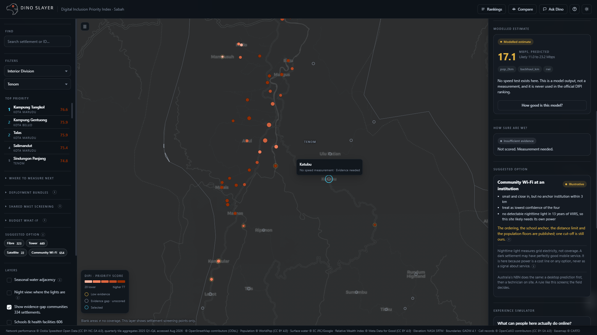
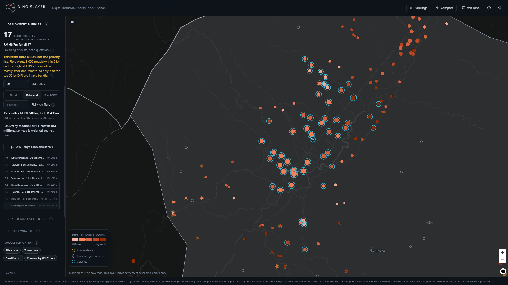
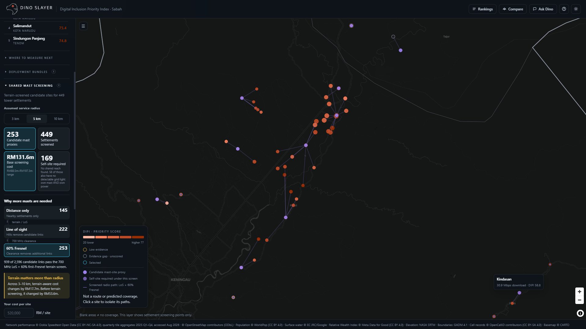
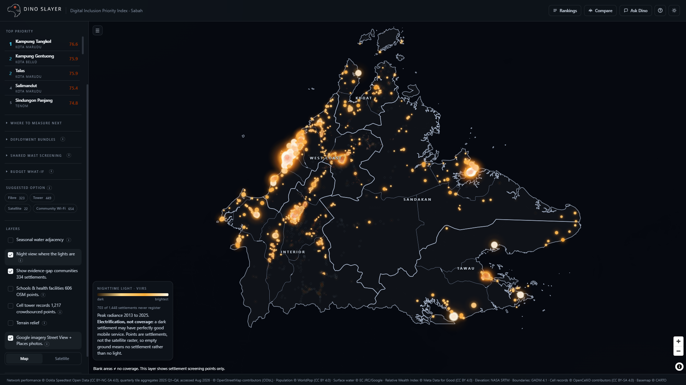
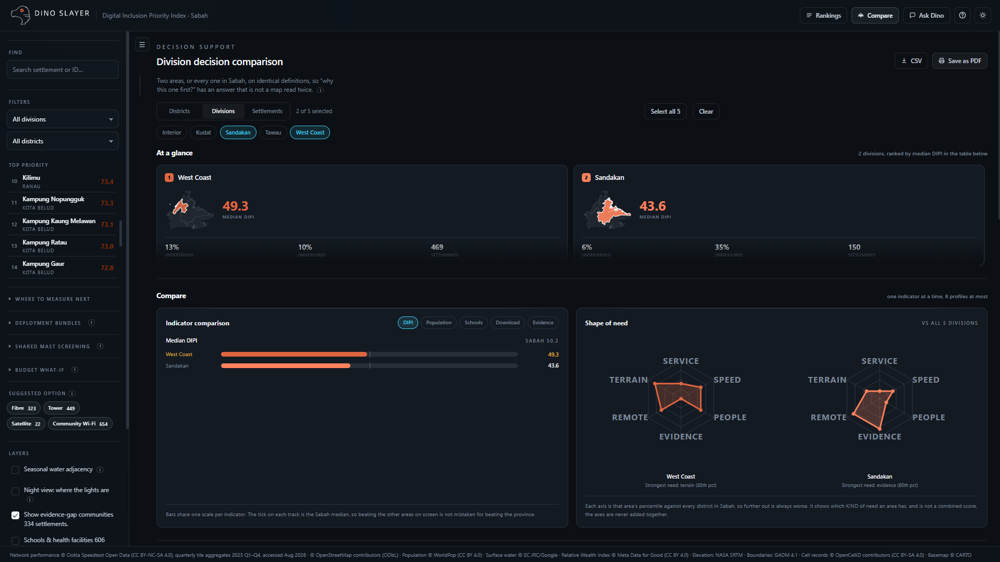
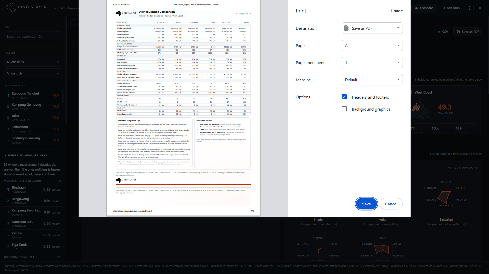
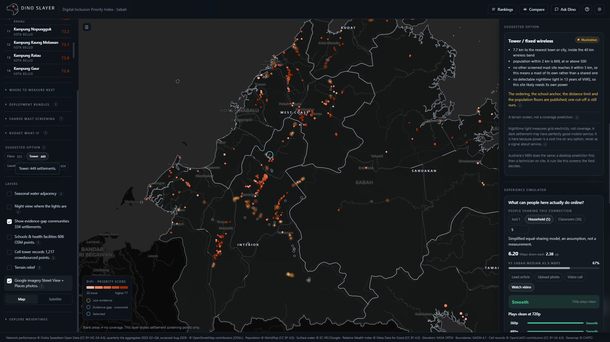
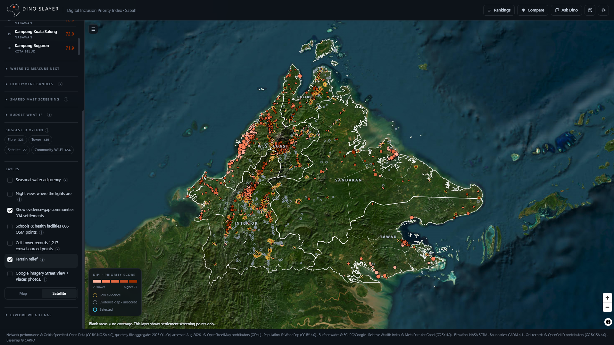

<div align="center">


### 1,448 villages in Sabah. One ranked list of where to look first.

A planning tool that scores every mapped settlement in Sabah on how badly it needs a
connectivity intervention, shows you the evidence behind each score, and lets you argue
with the weighting live. Ask it a question in plain English and the map follows the answer.

Built for **ASEAN GeoAI Fusion 2026** · Open data only · No account, no build step

</div>

---

## Try it

**Live dashboard — <https://dino-slayer.rzrexton.com>**

---

## Why we built it

Everyone already knows rural Sabah has a connectivity problem. What nobody could hand a
planner was a defensible answer to the next question, which village do we drive to first.

The honest obstacle is that we do not have coverage data. We have crowdsourced speed
tests, which is a different thing. A village with no Ookla samples is not a village with
no coverage, it is a village nobody has tested. Treating those two as the same is the
mistake that makes a map like this dangerous, so the whole tool is built around refusing
to make it.

So Dino Slayer scores what it can measure, says out loud where the measurement runs out,
and puts the 334 settlements it cannot score into a separate queue with their own ranking
for who to go and measure next. It screens. It does not certify.

---

## Getting started

**Prerequisites:** Python 3.10+ for the dataset scripts and the agent. Nothing else. The
dashboard is one HTML file with no build step.

Every derived file the browser reads is published by a script in `dataset/` that re-checks it
on the way through and refuses to write if a check fails. That is not ceremony: it has caught
a claim that all 216 unmeasured settlements were dark when 24 of them are lit, and a
population figure that double counted overlapping buffers by a factor of 25.

**The dashboard, on its own:**

```bash
git clone https://github.com/RextonRZ/dino-slayer.git
cd dino-slayer
python -m http.server
```

Open <http://localhost:8000/dashboard/>. Serve from the repo root, the page reads
`../dataset/web/` and browsers block `file://` fetches.

**Add the copilot** (optional, the dashboard works without it):

```bash
pip install -r agent/requirements.txt
copy agent\.env.example agent\.env      # then put your real Gemini key in agent\.env
python -m uvicorn agent.server:app --port 7860
```

`agent/.env` is gitignored. Never put a key in `.env.example`. The key must come from
[aistudio.google.com/apikey](https://aistudio.google.com/apikey), not the Google Cloud
console, and it must be a different key from the Maps one.

**Check the tools without the LLM:**

```bash
python -m agent.tools        # runs all 15 tools against the real data and prints the results
```

**Endpoints**

| Route | What |
|---|---|
| `GET /health` | Is it up, which model, how many settlements, which tools are registered |
| `POST /ask` | `{question, session_id}` to the full contract in one response |
| `POST /ask/stream` | The same, as server-sent events: one `step` per graph node, then `done` |

---

## Repo layout

```
README.md                    this file
index.html                   redirect to dashboard/, so the site root is the repo root
wrangler.toml                Cloudflare Workers config, serves the repo root
.assetsignore                what the CDN skips: docs, notebooks, the offline pipeline
_redirects  vercel.json      the same root redirect for Netlify and Vercel

dashboard/
  index.html                 the entire dashboard, one file, no build step
  README.md                  panel-by-panel notes and the Google imagery setup
  public/                    logo, mascot frames, Experience Simulator video clips

dataset/
  web/                       the 12 files the browser actually fetches
  ml/                        training table, folds, model artefacts, terrain, VIIRS
  network/                   Ookla parquet, by quarter
  settlements/               OSM settlements and facilities, OpenCelliD
  boundaries/                GADM 4.1 district polygons
  export_*.py                publish one derived file each, re-verifying it
  tower_scenarios.py         candidate mast-to-village paths
  tower_los.py               the set cover over paths that survive the terrain screen
  README.md                  every file, its row count and what it is for

agent/
  server.py                  FastAPI app: /health, /ask, /ask/stream
  graph.py                   the LangGraph state machine
  tools.py                   15 grounded tools over pandas
  test_agent.py              runs the tools against the real data
  requirements.txt           pinned; langgraph and langchain-core are a matched pair
  .env.example               copy to .env and add your key. .env is gitignored

notebook/
  01_data_preparation.ipynb  fuse the nine sources, build DIPI v0
  02_model_training.ipynb    coverage model, spatial CV, ablations, SHAP
  03_spatial_analysis.ipynb  bundling, survey routing, terrain screen, nightlights

docs/
  system_info.md             what the system does, what is geo, what is AI, the impact
  how_it_works.md            every panel, how each number is counted, and its source
  deployment_clusters.md     the bundling and mast work, including what failed
  viirs_nightlights.md       nightlights tested, rejected as a score, kept as a power flag
  ai_governance.md           NIST AI RMF mapping, generated by build_governance.py
  media/                     the screenshots in this README
```

## What it does

Six things, in the order a planner would use them. Screenshots of every panel
are in [Screenshots](#screenshots) at the end.

### See where the need is

| Panel | What it gives you |
|---|---|
| **The map** | Every settlement coloured by priority. Hollow rings have too little measurement to score, so an evidence gap looks like a gap and never like good news |
| **Settlement drill-down** | The case behind a score, pillar by pillar, with the raw numbers and how much measurement sits behind each |
| **Experience Simulator** | Turns a speed into a sentence a minister can use. At 30 shared users, Talas gets 0.38 Mbps each and everything stalls |
| **Nearby facilities** | Schools and clinics inside the same 3 km buffer that feeds the Institutions pillar |
| **Terrain** | Elevation correlates -0.25 with download speed, stronger than distance to town. It never enters the score; it explains a slow link |

### Work the list

| Panel | What it gives you |
|---|---|
| **Rankings** | All 1,114 scored settlements, sortable and filterable. Sorting never renumbers the rank column, so row 1 by latency is never mistaken for the top priority |
| **Compare** | Districts, divisions, or up to 20 settlements by name, on identical definitions. Prints to one page carrying the weighting that produced it |
| **Ask Dino** | Ask in plain English and the map flies to the answer. Every number comes from a Python tool, never from the model |

### Fill the gaps

| Panel | What it gives you |
|---|---|
| **Coverage model** | 216 settlements have no usable measurement. A gradient model estimates each with an interval and its top three SHAP drivers. Validated by district: MAE 34.1 Mbps spatially against 25.3 random, and that 35% gap is the finding |
| **Where to measure next** | The 334 unscored settlements ranked by stakes against interval width. Both shown, never multiplied: stakes times Mbps has no unit |

### Plan the build

| Panel | What it gives you |
|---|---|
| **Budget what-if** | Set a budget and see how far down the list it reaches. No Malaysian per-unit cost is published, so the defaults are ITU benchmarks you can type over |
| **Deployment bundles** | Two villages sharing one trench were each billed for the whole thing. Bundling drops fibre from RM 190.9m to RM 89.0m, and says only 6 of the top 50 are in any bundle |
| **Shared mast screening** | Distance alone said 86 to 189 masts. Screening every path for line of sight and 60% Fresnel says **240 to 274**, because four in five are blocked |
| **Suggested option** | Filter by what the recommender suggests: fibre 323, tower 449, satellite 22, community Wi-Fi 654. A filter, not a colour, so dots keep their DIPI reading |

### Read the context

| Layer | What it gives you |
|---|---|
| **Night view** | Thirteen years of VIIRS radiance as a map mode. **703 of 1,448 register nothing**, so anything sited there brings its own power. A mode and not an overlay, because an overlay would say those places are worse served and the data does not know that |
| **Cell tower records** | 1,217 OpenCelliD masts as context, never a feature: record count correlates 0.56 with test count, so it maps where volunteers went, not what is built |
| **Satellite and light theme** | Esri imagery for checking a village against the ground it sits on. Deep red is the top of the scale in both palettes, and dot outlines thicken over imagery to hold their edge |

### Argue with it

**The four pillar weights are ours, not a law of nature.** Move them and every
score, rank and colour recomputes live, stamped into the panel and the CSV so a
figure can never be quoted without the weighting that produced it.

## How the score is built

DIPI is a weighted sum of four pillars, each a percentile rank across the 1,114 scored
settlements. Percentile rank, not min-max, so one outlier village cannot flatten the
scale for everyone else.

| Pillar | Weight | What it measures | Direction |
|---|---|---|---|
| Connectivity | 40% | Median Ookla download speed | Slower scores higher |
| Population | 25% | People within 2 km (WorldPop) | More people scores higher |
| Institutions | 15% | Schools plus clinics within 3 km (OSM) | More institutions scores higher |
| Equity | 20% | Relative Wealth Index (Meta) | Poorer scores higher |

Every one of those is reproducible from `dataset/settlements/settlements_sabah_03_dipi.parquet`.
The weights recover to 40.00 / 25.00 / 15.01 / 20.00 by least squares against the stored
DIPI, and each pillar correlates 1.0000 with the percentile rank of its own input. The
full derivation, including the evidence tier rule, is in [dataset/README.md](dataset/README.md).

Every other number on the screen, panel by panel, with the arithmetic and the source behind
each one, is in [docs/how_it_works.md](docs/how_it_works.md).

**Three evidence tiers, and only two of them get a score.**

| Tier | Rule | Count | What happens |
|---|---|---|---|
| Measured | 20+ tests across 3+ Ookla tiles | 850 | Scored and ranked |
| Low evidence | 5+ tests | 264 | Scored, flagged, drawn with a detached amber ring |
| Insufficient | fewer than 5 tests | 334 | **Never scored.** Ranked separately by what is at stake |

---

## Ask Dino

A LangGraph state machine over Gemini, with fifteen pandas tools and one rule: **Python
computes, the agent narrates.** The model never emits a number or a settlement ID of its
own. It calls a tool, the tool returns figures, and a deterministic evidence check reads
the raw tool rows, not the model's prose, before anything reaches the user. Up to two
rewrites, then a hard-templated safe answer.

| Tool | Answers |
|---|---|
| `rank_settlements` | Who is highest priority, filtered by district or division |
| `explain_priority` | Why this settlement scores what it scores |
| `compare_settlements` | This one against that one, pillar by pillar |
| `simulate_experience` | What a class of 30 could actually stream here |
| `district_summary` | Which district has the most schools, health points or evidence gap |
| `list_facilities` | The actual names of schools, clinics and hospitals |
| `predict_coverage` | Modelled speed where there is no measurement, always labelled |
| `recommend_intervention` | Which delivery option fits the geography |
| `optimise_budget` | How far a given budget reaches down the list |
| `plan_survey` | Where to send a field team next |
| `generate_validation_report` | The dataset's own integrity checks |
| `compare_areas` | Any number of districts or divisions on identical definitions |
| `find_failing_schools` | Schools whose link cannot carry 360p once a classroom shares it |
| `rank_bundles` | Which fibre bundles a budget reaches, under three scenarios |
| `explain_bundle` | What is in one bundle and what its trench actually costs |

**You can watch it think.** The panel streams the graph's real node transitions over
server-sent events: which tools it chose, how many rows each returned, whether the
evidence check passed, and whether the guardrail sent the draft back. Those are the actual
state machine steps, not a progress animation.

**It remembers the conversation.** One LangGraph thread per panel, so "why is that one
ranked first?" resolves against the previous turn. Reloading the page starts fresh.

The dashboard never hard depends on any of it. With the agent server down, the panel says
so and nothing else on the page changes. Without server-sent events it falls back to a
plain POST.

Setup is in [agent/.env.example](agent/.env.example). You need your own Gemini key from
[aistudio.google.com/apikey](https://aistudio.google.com/apikey). A Google Cloud key made
for Maps will not work here, they are different products on different APIs.

---

## What it refuses to say

These are not disclaimers bolted on at the end, they are enforced in code and tested.

- **Blank map is not "no coverage."** The map carries that sentence permanently.
- **Missing data never reads as poor service.** No measurement means no score, not a bad score.
- **Population is never summed.** `pop_2km` buffers overlap, so adding them double counts. The tool reports counts and medians instead.
- **Google imagery is context, never evidence.** It is off by default, capped at 50 calls per session, and never feeds a score.
- **The agent cannot confirm coverage.** Asked to, it explains that this is a screening tool and declines.

We mapped the build against all 72 subcategories of the NIST AI Risk Management Framework
Playbook and kept the 22 where we can point at a control that actually exists in this
repo. The rows we dropped are listed with the reason. See
[docs/ai_governance.md](docs/ai_governance.md), which is generated from the published NIST
JSON so the quotes cannot drift.

---

## Data sources

Every source is open, and every one is credited in the dashboard footer as well as here.

| Source | Used for | Licence |
|---|---|---|
| [Ookla Open Data](https://github.com/teamookla/ookla-open-data) | Download, upload, latency, test counts | CC BY-NC-SA 4.0 |
| [OpenStreetMap](https://www.openstreetmap.org/copyright) | Settlement points, schools, clinics | ODbL |
| [WorldPop](https://www.worldpop.org/) | Population within 2 km | CC BY 4.0 |
| [Meta Relative Wealth Index](https://dataforgood.facebook.com/dfg/tools/relative-wealth-index) | Equity pillar | CC BY 4.0 |
| [JRC Global Surface Water](https://global-surface-water.appspot.com/) | Seasonal water context | EC JRC / Google |
| [NASA SRTM](https://www.earthdata.nasa.gov/data/instruments/srtm) | Elevation and terrain context | Public domain |
| [GADM 4.1](https://gadm.org/) | District and division boundaries | Free for academic use |
| [OpenCelliD](https://opencellid.org/) | Cell record context layer, never a model feature | CC BY-SA 4.0 |
| [NOAA VIIRS VNL V2](https://eogdata.mines.edu/products/vnl/) | Night view and the power flag | Public domain |
| [CARTO](https://carto.com/basemaps/) / [Esri World Imagery](https://www.arcgis.com/home/item.html?id=10df2279f9684e4a9f6a7f08febac2a9) | Basemaps | Attribution required |

Twenty published figures behind the thresholds and unit costs are registered in
`dataset/web/sources.json` with the quote, the page and how far each was verified, and the
dashboard reads that file at load so its tooltips and the docs cannot drift apart. Four
frameworks set method rather than numbers: the NIST AI RMF Playbook, ITU-R P.530, ITU-R
P.1812 and ITU-T G.114.

Details, file by file, in [dataset/README.md](dataset/README.md).

---

## Tech stack

**Dashboard:** one HTML file. MapLibre GL JS v5 from CDN, no framework, no bundler, no
dependencies to install.
**Agent:** LangGraph, LangChain, Gemini, FastAPI, pandas.
**Data:** pandas and pyarrow over Parquet, exported to GeoJSON for the browser.

---

## Screenshots

**Map overview.** Every settlement by priority. Hollow rings cannot be scored yet.


**Experience simulator.** What a link can actually carry once 30 people share it.


**Nearby facilities.** Schools and clinics inside the 3 km buffer that feeds the Institutions pillar.


**Rankings.** All 1,114 scored settlements. Sorting never renumbers the rank column.


**Ask Dino.** Ask Dino. Every number in the reply comes from a Python tool.


**Model card.** No modelled number appears without its validation metrics one click away.



**Survey planner.** Where to measure next: stakes against interval width, never multiplied.


**Budget what-if.** Budget what-if, on ITU benchmarks you can type over.


**Deployment bundles.** Deployment bundles. Sharing a trench drops fibre from RM 190.9m to RM 89.0m.



**Shared mast screening.** Shared masts after the terrain screen: 240 to 274, not 86 to 189.



**Night view.** Night view. 703 of 1,448 settlements register no light in thirteen years.



**Compare settlements.** Compare up to 20 settlements on identical definitions.



**Comparison report.** The printed sheet carries the weighting that produced it.



**Suggested option.** Filter by suggested option. A filter, not a colour.



**Weightings.** Move the four weights and every score, rank and colour recomputes live.


**Light theme.** Light theme. Deep red is the top of the scale in both palettes.


**Satellite basemap.** Satellite. Whether a village is cleared land or forest, and what a trench crosses.



---

## License

MIT for the code. The data keeps its own licences, listed above.
